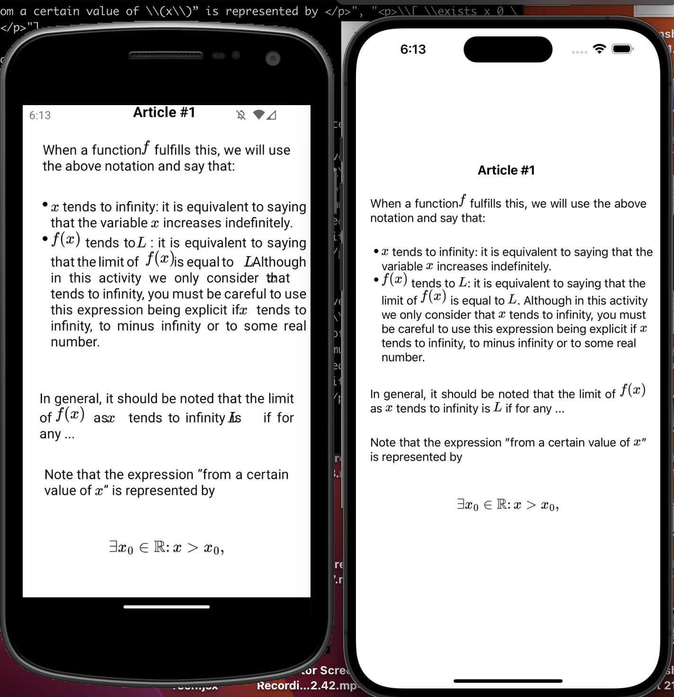
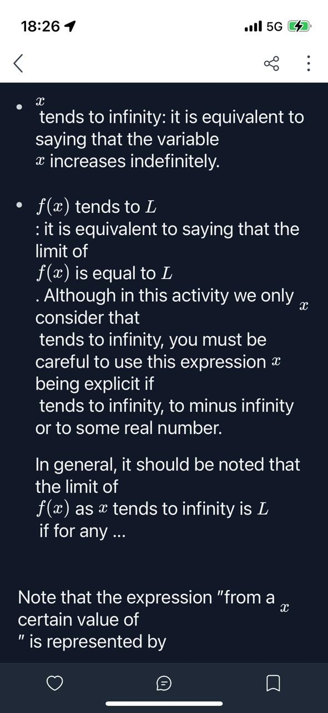
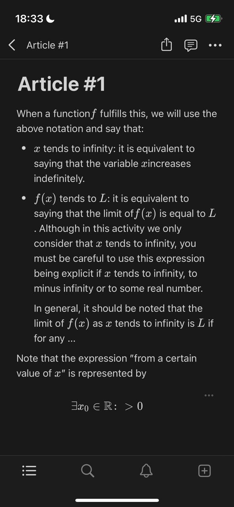

# Math Equations in an Expo project

## Introduction

This repo is a minimal, reproducible example of a rendering issue of in-line mathematical equations using 3 3 main libraries: `expo` to run our mobile app, `react-native-render-html` to render html content in our mobile app, and `react-native-mathjax-html-to-svg` to leverage the power of or rendering library to display latex equations within our html content.

This exercise would not be possible without this [fantastic post](https://engineering.hashnode.com/how-to-display-math-equations-in-react-native) by @foxfl, where he explains how the Hashnode Engineering team combines both libraries to power their rendering engine for mathematical equations inside theire mobile app.

## Problem

Overall, the solution presented in this repository works fine: Math equations are successfully rendered in the app. However, there is a significant difference in the rendering between *in-line* math equations and *block* or *display* mathematics.

Display mathematics usually looks good, as they have plenty of space. The only time there is an issue is when we write long lines of math equations without breaklines, causing the SVG to extend beyond the margins of our screen. But this is not a problem since we can always write the LaTeX equations in a better format.

The main issue (and headache) arises when we try to render in-line mathematics, as it doesn't always look good. By that, I mean that the SVG generated by the rendering engine often overlaps with the non-mathematical text that precedes it or is not aligned with the same baseline as the text. As a result, it looks odd or even becomes unintelligible. This occurs in both iOS and Android simulators, with the issue being more pronounced in the Android simulator.

To illustrate this, please refer to the following image:



On the left, the Android Simulator. On the Right the iOS.

## Expected behavior

The expected result is to be able to visualize in-line math equations in the same manner as they would appear in a Hashnode article, Notion page, or LaTeX document. This includes having the equations aligned with the content, placed on the same baseline, and rendered at a similar size to the surrounding font.

Here are some images for reference:

### Hashnode editor



Notice though hashnode editor isn't perfect, it has some of the issues I've already described.

### Notion editor



here the Notion editor does a better job.

---

## Install and Development

First, install dependencies

```zsh
yarn install
```

To run the project

```zsh
yarn expo start
```

press `a` to run the Android simulator, and `i` to run the iOS simulator.

## FIles

`html.json`: this file stores a list contaning html paragraphs with latex formulas.

`App.js`: This file renders each paragraph in `html.json` into the Screen. To do that, each paragraph renders through the `RenderingEngine Component.`

`RenderingEngine.jsx`: This is the React Component where everything happens. Here we use the method of the article mentionted to create a custom renderer for our custom tag `<math></math>. `

The Engine receives a html string as a prop, and identifies which section of that string corresponds to a latex equation. When detecting a latex equation, it will identify whether it's an in-line equation or a block equation. Then, it will wrap that substring accordingly with the `math` tag, returning a new string. This new string will be the html source for the `RenderHTMLSource` Component, a `react-native-render-html` Component.
